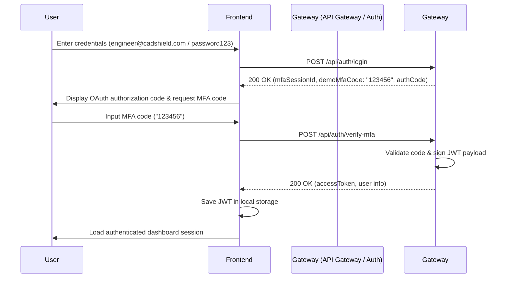

# CADShield Gateway


A minimal but fully working security and API gateway dashboard web application for a CAD/AutoCAD-style engineering company. It demonstrates security controls and multiple API protocols communicating through a centralized API Gateway layer.

## Overview

CADShield Gateway is a secure portal designed for CAD engineering environments. It enables users to authenticate, verify MFA, obtain a JWT access token, and interact with REST, GraphQL, SOAP, and FHIR APIs through an API Gateway to query and register engineering schemas and drawings.

---

## Strict Tech Stack

This project demonstrates and incorporates strictly the following technology stack:
- **RESTful APIs**
- **GraphQL**
- **SOAP**
- **FHIR**
- **OAuth 2.0**
- **JWT**
- **API Gateway**
- **Multi-Factor Authentication**
- **JSON**

*No database, cloud, banking, healthcare, AI, payment, machine learning, or external service integrations are included in this project.*

---

## Business Use Case

Engineering users need secure, programmatic access to CAD design drawings and project metadata. CADShield Gateway provides a single administration portal where an engineer or auditor can log in using OAuth 2.0 credentials, verify their session via multi-factor authentication (MFA), retrieve a signed JWT token containing role claims, and test various gateway-protected protocol queries (REST, GraphQL, SOAP, FHIR JSON).

---

## Features

- **OAuth 2.0 & MFA Authentication Flow**: Seamless two-step login that simulates auth code generation and issues signed tokens.
- **Role-Based Authorization**: Route restrictions that validate claims for ADMIN, ENGINEER, VIEWER, and AUDITOR users.
- **RESTful endpoints**: Simple CRUD capabilities for CAD projects.
- **Active GraphQL Router**: Executes custom query schemas and mutation resolvers.
- **SOAP XML Handler**: Serves GetStatus, Lock, and Unlock operations on drawings using standard SOAP body structures.
- **FHIR-Style Mappings**: Maps project drawing records to FHIR CADDesign resource JSON types.
- **Audit Trails**: Dynamically records and serves gateway event audit logs.

---

## Authentication Flow



---

## API Gateway Routes

The centralized API Gateway exposes the route directory via:
`GET /api/gateway/routes`

### Response Payload
```json
{
  "gatewayName": "CADShield API Gateway",
  "status": "ACTIVE",
  "securedBy": ["OAuth 2.0", "MFA", "JWT"],
  "supportedApis": ["RESTful APIs", "GraphQL", "SOAP", "FHIR", "JSON"],
  "routes": {
    "auth": [
      "POST /api/auth/login",
      "POST /api/auth/verify-mfa"
    ],
    "rest": [
      "GET /api/cad-projects",
      "GET /api/cad-projects/:id"
    ],
    "graphql": [
      "POST /graphql"
    ],
    "soap": [
      "POST /soap/cad-vault"
    ],
    "fhir": [
      "GET /api/fhir/cad-designs",
      "GET /api/fhir/cad-designs/:id"
    ],
    "audit": [
      "GET /api/audit-logs"
    ]
  }
}
```

---

## Protocol Examples

### RESTful API Example
`GET /api/cad-projects`
```json
[
  {
    "id": "CAD-PRJ-1001",
    "name": "Factory Floor Layout",
    "drawingFile": "factory-floor-layout.dwg",
    "status": "ACTIVE",
    "classification": "CONFIDENTIAL",
    "owner": "engineer@cadshield.com",
    "lastUpdated": "2026-06-03T10:00:00Z"
  }
]
```

### GraphQL Example
`POST /graphql`
**Query Payload:**
```graphql
query {
  cadProjects {
    id
    name
    drawingFile
    status
    classification
  }
}
```
**JSON Response:**
```json
{
  "data": {
    "cadProjects": [
      {
        "id": "CAD-PRJ-1001",
        "name": "Factory Floor Layout",
        "drawingFile": "factory-floor-layout.dwg",
        "status": "ACTIVE",
        "classification": "CONFIDENTIAL"
      }
    ]
  }
}
```

### SOAP Example
`POST /soap/cad-vault`
**Request Payload:**
```xml
<Envelope>
  <Body>
    <GetDrawingStatus>
      <DrawingId>CAD-PRJ-1001</DrawingId>
    </GetDrawingStatus>
  </Body>
</Envelope>
```
**Response XML:**
```xml
<Envelope>
  <Body>
    <GetDrawingStatusResponse>
      <DrawingId>CAD-PRJ-1001</DrawingId>
      <Status>ACTIVE</Status>
      <Locked>false</Locked>
      <LockedBy></LockedBy>
    </GetDrawingStatusResponse>
  </Body>
</Envelope>
```

### FHIR JSON Example
`GET /api/fhir/cad-designs/CAD-FHIR-1001`
```json
{
  "resourceType": "CADDesign",
  "id": "CAD-FHIR-1001",
  "meta": {
    "versionId": "1",
    "lastUpdated": "2026-06-03T10:00:00Z",
    "security": ["CONFIDENTIAL"]
  },
  "identifier": [
    {
      "system": "https://cadshield.local/cad-designs",
      "value": "CAD-PRJ-1001"
    }
  ],
  "status": "active",
  "subject": {
    "reference": "CADProject/CAD-PRJ-1001",
    "display": "Factory Floor Layout"
  },
  "authoredOn": "2026-06-03T10:00:00Z"
}
```

---

## JWT Security

JWT tokens are signed by the gateway backend with a secret key. Protected endpoints analyze the headers to verify:
- Presence of `Authorization: Bearer <JWT>`
- Expiry date
- Validity of claims (User ID, Email, Role)

**Unauthorized Response (401):**
```json
{
  "status": 401,
  "message": "Unauthorized. JWT token is required."
}
```

**Forbidden Response (403):**
```json
{
  "status": 403,
  "message": "Forbidden. You do not have access to this resource."
}
```

---

## MFA Security

Authentication is protected by an in-memory MFA session store. An access token is only generated if the provided 6-digit MFA passcode matches the specific user configuration generated during Step 1.

---

## How to Run

### Backend
1. Open a terminal, move to the backend directory, install packages, and start:
   ```bash
   cd backend
   npm install
   npm run dev
   ```
   The backend will start on: **`http://localhost:5000`**

### Frontend
1. Open a new terminal window, move to the frontend directory, install packages, and start:
   ```bash
   cd frontend
   npm install
   npm run dev
   ```
   The frontend dev server will launch on: **`http://localhost:5173`**

---

## Sample Login Credentials

Use these engineering credentials to test the dashboard operations:

| Name | Username / Email | Password | Role | MFA Code |
| :--- | :--- | :--- | :--- | :--- |
| **Admin User** | `admin@cadshield.com` | `password123` | `ADMIN` | `123456` |
| **CAD Engineer** | `engineer@cadshield.com` | `password123` | `ENGINEER` | `123456` |
| **CAD Viewer** | `viewer@cadshield.com` | `password123` | `VIEWER` | `123456` |
| **API Auditor** | `auditor@cadshield.com` | `password123` | `AUDITOR` | `123456` |

---

## Dashboard Pages

1. **Login Page**: Prompts for username, password, and handles sandbox MFA validation.
2. **Dashboard Page**: Renders the 9 mandatory technology cards, profile info, and live telemetry metric cards.
3. **API Gateway Page**: Lists routing rules grouped by backend operations directly from the gateway service.
4. **CAD Projects Page**: Standard drawing catalog listing with built-in creation panel for authorized personnel.
5. **API Testing Page**: Dynamic sandbox to invoke live REST, GraphQL schemas, SOAP envelopes, and FHIR payloads.
6. **Security Page**: Access token detail breakdown, claims verification, and security middleware response checks.
7. **Audit Logs Page**: Comprehensive trail logging authentication, requests, and unauthorized errors.

---

## Resume Bullet Points

- Built CADShield Gateway, a secure CAD design access dashboard using RESTful APIs, GraphQL, SOAP, FHIR-style JSON, OAuth 2.0, JWT, API Gateway, Multi-Factor Authentication, and JSON.
- Implemented OAuth 2.0-style login, MFA verification, JWT token generation, and protected API access for CAD project metadata.
- Developed working REST, GraphQL, SOAP, and FHIR JSON API demonstrations through a centralized API Gateway.
- Created a minimal dashboard to test secured APIs, view CAD projects, inspect JWT payloads, and monitor audit logs.
